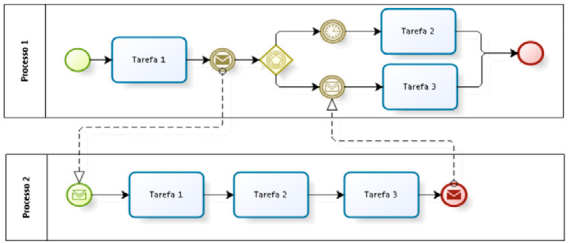

# Tipos de Diagramas

## 1. Tipos de Diagramas BPMN

### 1.1 Processo Privativo (ou Interno)
- Utilizado quando não há interesse em verificar a interação entre o processo e outros processos.
- Representa o processo de forma isolada, sem relação com outros fluxos.

    

      

### 1.2 Processo Abstrato
- Representa a interação entre um processo principal e outro processo participante.
- Em relação ao processo participante, não há preocupação com o conteúdo do fluxo em si, mas sim com a forma como ele colabora com os outros fluxos.
- O envelope preenchido significa envio, o envelope vazio significa recebimento.

    

            

### 1.3 Processo Colaborativo
- Descreve a interação entre duas ou mais entidades do negócio.
- O conteúdo do fluxo é especificado em todas as entidades.
- É o mais completo, pois detalha o processo principal e os demais existentes.

    

             

> [!TIP] DICAS:
> - Os três tipos básicos de diagramas BPMN são: privativo (interno), abstrato e colaborativo.
> - O BPMN permite mapear processos internos, abstratos e de colaboração.

> [!CAUTION] OBSERVAÇÃO:
> - Processos de colaboração no BPMN tratam da colaboração entre processos, não necessariamente de relações B2B entre organizações.