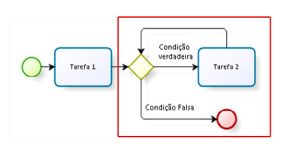
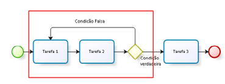
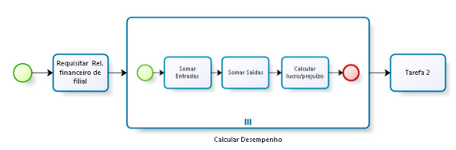
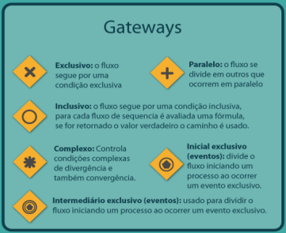
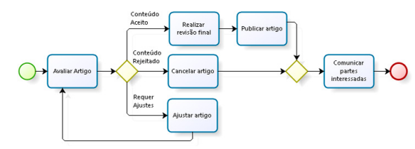
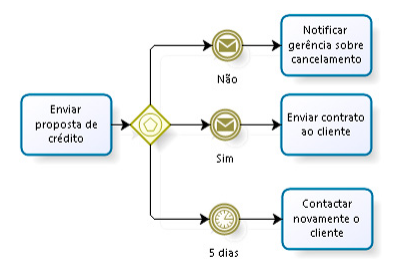
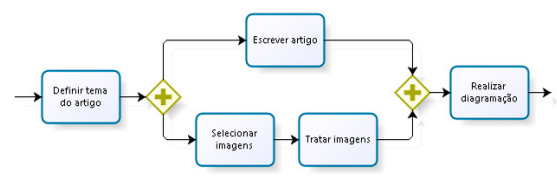
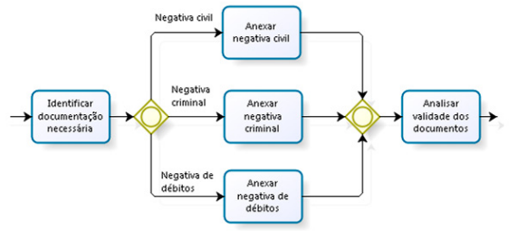

# Elementos BPMN 2

## 1. Atividades em BPMN
- Atividades representam o trabalho executado em um processo.
- Podem ser classificadas em dois tipos principais:
  - Tarefa;
  - Subprocesso.
- A tarefa é a atividade no menor nível de granularidade (ação atômica), sendo representada por um retângulo arredondado.
- O subprocesso é um conjunto lógico de atividades com um propósito específico.
- Subprocesso pode ser apresentado de duas formas:
  - Contraída: exibe um símbolo [+] na base inferior, indicando que contém um conjunto de tarefas;
  - Expandida: demonstra abertamente o processo nele contido.

## 2. Tipos de Tarefas
- As tarefas são classificadas conforme sua natureza e forma de execução.

### 2.1 Tarefa Abstrata
- Tipo de atividade mais utilizado nos estágios iniciais do desenvolvimento do processo.
- Serve como representação preliminar da atividade.

    

  

### 2.2 Tarefa de Serviço
- Atividade que ocorre automaticamente, sem necessidade de intervenção humana.
- Executada por sistema ou aplicação.

    

    

> [!TIP] DICAS:
> - A tarefa de serviço é a única que ocorre de forma completamente automática.
> - Cai frequentemente em provas: "atividade que ocorre automaticamente sem intervenção humana = tarefa de serviço".

### 2.3 Tarefa de Recebimento
- Atividade de recebimento de mensagem.
- Possui característica similar ao evento intermediário de recebimento de mensagem.
- Aguarda a chegada de uma mensagem para prosseguir.

    

  

### 2.4 Tarefa de Envio
- Atividade de envio de mensagem.
- Possui característica similar ao evento intermediário de envio de mensagem.
- Envia uma mensagem para outro participante ou sistema.

    

  

### 2.5 Tarefa de Usuário
- Executada por uma pessoa com o auxílio ou por intermédio de um sistema.
- O sistema auxilia o usuário na execução da tarefa.

    

  

### 2.6 Tarefa de Execução de Script
- Utilizada quando existe um roteiro ou checklist a ser seguido durante a execução da atividade.
- Segue um script pré-definido.

    

  

### 2.7 Tarefa Manual
- Executada por uma pessoa, sem qualquer intervenção de sistema.
- Não há suporte ou auxílio de ferramentas automatizadas.

    

  

### 2.8 Tarefa de Regra de Negócio
- Propicia um mecanismo para o processo enviar informações a um Business Rules Engine (motor de regras de negócio).
- Obtém o resultado do cálculo que o motor de regras pode prover.

    

    

> [!CAUTION] OBSERVAÇÃO:
> - Diferencie bem: tarefa de usuário (com sistema) x tarefa manual (sem sistema) x tarefa de serviço (automática).

### Tabela Resumo - Tipos de Tarefas

| TIPO DE TAREFA | CARACTERÍSTICA PRINCIPAL |
|----------------|--------------------------|
| Abstrata | Utilizada em estágios iniciais do desenvolvimento |
| Serviço | Ocorre automaticamente, sem intervenção humana |
| Recebimento | Aguarda recebimento de mensagem |
| Envio | Realiza envio de mensagem |
| Usuário | Executada por pessoa com auxílio de sistema |
| Execução de script | Segue um roteiro/checklist |
| Manual | Executada por pessoa sem sistema |
| Regra de negócio | Interage com motor de regras de negócio |

## 3. Tipos de Subprocessos

### 3.1 Subprocesso Incorporado
- Herda todas as características do processo em que está inserido.
- Não pode conter piscinas (pools) ou raias (lanes).
- É parte integrante do processo pai.

    

  

### 3.2 Subprocesso Reutilizável
- É uma referência ao diagrama de outro processo.
- Indica que o subprocesso está sendo reutilizado no fluxo em que está inserido.
- Exemplo: processo de cálculo de férias reutilizado em diferentes contextos.
- Diferenciação visual: os símbolos dos subprocessos incorporado e reutilizável se diferenciam pela espessura da linha.

    

    

> [!TIP] DICAS:
> - Subprocesso incorporado é dependente do processo pai; subprocesso reutilizável é independente e pode ser chamado por vários processos.

### 3.3 Subprocesso Eventual
- Representa um conjunto lógico de atividades que pode ou não acontecer durante a execução de um processo.
- O início não está vinculado à sequência de atividades do fluxo, mas à ocorrência de um evento.
- Exemplo: um subprocesso que só é executado se um evento específico ocorrer.

    

  

### 3.4 Subprocesso Transacional
- Conjunto de atividades logicamente relacionadas que devem ser realizadas em uma única transação.
- Exemplo: operação bancária (todas as atividades devem ser concluídas com sucesso ou a transação é desfeita).

    

    

> [!CAUTION] OBSERVAÇÃO:
> - Subprocesso transacional exige que todas as atividades sejam executadas com sucesso; caso contrário, ocorre o rollback da transação.

## 4. Repetição em Loop
- Atividade de loop padrão possui uma expressão booleana avaliada para cada ciclo.
- Se a expressão for verdadeira, o loop continua.
- Duas variações de loop:
  - WHILE (enquanto): avalia a expressão antes da atividade ser realizada (pode não ser executada);
  - UNTIL (até): avalia a expressão após a realização da atividade (executada pelo menos uma vez).

    

    

### 4.1 Loop WHILE
- Condição verdadeira ⟶ realização da tarefa.
- Condição falsa ⟶ nenhuma ação.
- A tarefa se repete enquanto a condição permanecer verdadeira.

    

       

### 4.2 Loop UNTIL
- A atividade é realizada pelo menos uma vez.
- A tarefa acontece e é repetida até que a condição verdadeira seja verificada.
- Condição verdadeira ⟶ avança para a próxima tarefa.
- Condição falsa ⟶ retorna para a tarefa anterior.

    

       

### 4.3 Loop Multi-Instance
- A expressão de avaliação é numérica.
- Avaliada antes da atividade ser realizada.
- O resultado é um número inteiro que especifica quantas vezes a atividade se repetirá (FOR).
- Duas variações:
  - Sequencial: as instâncias são executadas uma após a outra;
  - Paralela: as instâncias são executadas simultaneamente.
- Exemplo: matriz verificando resultados financeiros de todas as filiais (quantidade de filiais define o número de repetições).

    

         

## 5. Gateways
- Gateways realizam a divisão e a unificação de fluxos.
- Controlam o fluxo do processo conforme condições lógicas.

    

                

### 5.1 Gateway Exclusivo Baseado em Dados
- Divisão: dá seguimento ao fluxo por uma condição exclusiva.
- Apenas um dos caminhos será seguido.
- Funciona como um "ou" (um ou outro caminho, nunca mais de um).
- Unificação: dá seguimento ao fluxo quando um dos caminhos atingir o gateway.
- O primeiro caminho que chegar dá continuidade ao processo.

    

             

> [!TIP] DICAS:
> - Gateway exclusivo = "ou exclusivo" = apenas um caminho é escolhido.

### 5.2 Gateway Exclusivo Baseado em Eventos
- Alternativa de pontos de ramificação onde a decisão é baseada em dois ou mais eventos.
- Mesmo comportamento do gateway exclusivo baseado em dados: somente uma ramificação será escolhida.
- Processos que envolvem comunicação com parceiro de negócio ou entidade externa necessitam deste comportamento.

    

            

### 5.3 Gateway Paralelo
- Divisão: divide um fluxo em dois ou mais fluxos executados paralelamente.
- Funciona como um "e" (um e outro caminho serão seguidos).
- Unificação: sincroniza vários caminhos paralelos.
- Só dá sequência quando todos os caminhos de entrada forem completados.
- Garante que todos os fluxos paralelos sejam concluídos antes de continuar.

    

          

> [!TIP] DICAS:
> - Gateway paralelo = "e" = todos os caminhos são executados simultaneamente.
> - Na convergência, aguarda a conclusão de todos os fluxos.

### 5.4 Gateway Inclusivo
- Divisão: dá seguimento ao fluxo por uma condição inclusiva.
- Pode haver uma combinação dos caminhos ativados.
- Funciona como um "e/ou" (um ou mais caminhos podem ser seguidos).
- Unificação: sincronização de todos os fluxos ativos em comum.
- Garante que todos os fluxos em execução sejam concluídos antes de continuar.

    

             

> [!CAUTION] OBSERVAÇÃO:
> - Gateway inclusivo se assemelha ao paralelo (executa mais de um fluxo), mas pode executar todos ou somente alguns fluxos.
> - Diferença crucial: no paralelo, TODOS os fluxos são executados; no inclusivo, UM OU MAIS fluxos são executados conforme a condição.

### Tabela Resumo - Gateways

| TIPO DE GATEWAY | DIVISÃO (FORK) | UNIFICAÇÃO (JOIN) | COMPORTAMENTO |
|-----------------|----------------|-------------------|---------------|
| Exclusivo baseado em dados | Apenas um caminho é escolhido | Primeiro caminho que chega dá sequência | OU exclusivo |
| Exclusivo baseado em eventos | Apenas um caminho é escolhido com base em eventos | Primeiro evento que ocorre dá sequência | OU exclusivo (eventos) |
| Paralelo | Todos os caminhos são executados | Aguarda TODOS os caminhos | E |
| Inclusivo | Um ou mais caminhos são executados | Aguarda TODOS os ativos | E/OU |

## 6. Repetição em Loop Multi-Instance
- Avaliação numérica define quantas vezes a atividade será repetida.
- Execução sequencial: uma instância por vez.
- Execução paralela: todas as instâncias simultaneamente.
- Exemplo: verificação de desempenho de filiais, onde o número de filiais define a repetição.