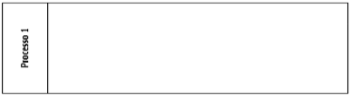
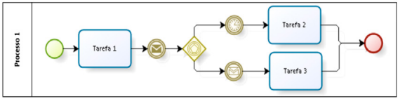
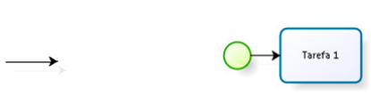
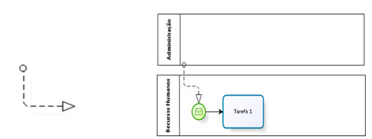
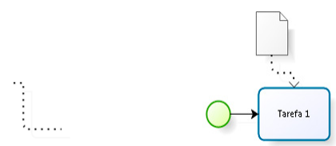

# Elementos BPMN

## 1. Elementos de Organização: Pool e Lane

### 2.1 Pool (Piscina)
- Representa um processo ou uma entidade.
- Define o ator mais amplo, como a organização.

    

      

### 2.2 Lane (Raia)
- É uma subpartição dentro da pool.
- Usada para organizar e categorizar a pool.
- Representa papéis, áreas ou responsabilidades no processo.
- Normalmente recebem nomes de departamentos ou personagens que executarão a operação.

    

      

### 2.3 Milestone (Etapa)
- É uma subpartição dentro do processo.
- Usada para organizar o processo em etapas.
- Milestone não faz parte da notação BPMN padrão; é uma extensão implementada pela Bizagi.

    

       

> [!TIP] DICAS:
> - Pool é o ator mais amplo (ex.: organização). Lane é a subdivisão (ex.: departamento).
> - O uso de swim lanes tem a vantagem de delimitar as responsabilidades de cada departamento.

> [!CAUTION] OBSERVAÇÃO:
> - Swim lanes não são uma notação distinta, mas uma atribuição de responsabilidade que pode ser incorporada no BPMN, EPC, UML ou fluxogramas.

## 3. Conectores BPMN

### 3.1 Fluxo de Sequência (Sequence Flow)
- Usado para mostrar a ordem em que as atividades serão executadas.
- Cada fluxo tem só uma origem e só um destino.
- Representado por uma linha contínua com seta.

    

       

### 3.2 Fluxo de Mensagem (Message Flow)
- Usado para mostrar o fluxo de mensagem entre dois participantes.
- Representa a comunicação entre duas entidades ou processos.
- Utilizado entre duas pools.

    

         

### 3.3 Associação
- Usada para associar informações com objetos de fluxos.

    

           

> [!TIP] DICAS:
> - Fluxo de sequência: ordem de execução, uma origem e um destino.
> - Fluxo de mensagem: comunicação entre dois participantes (pools).

> [!CAUTION] OBSERVAÇÃO:
> - Swim lanes (pool e lane) são frequentemente incorporadas no BPMN, EPC, UML e fluxogramas para definir quem executa cada atividade.
> - As swim lanes são representadas como longos retângulos verticais ou horizontais, assemelhando-se às marcações de pistas numa competição de natação.