# Elementos BPMN 3

## 1. Eventos em BPMN
- Eventos representam algo que acontece durante o processo e apresentam uma causa ou um impacto no fluxo.
- São simbolizados por um círculo.
- Classificam-se em três tipos básicos conforme o momento em que ocorrem.

### 1.1 Classificação Básica dos Eventos
- De forma básica, há três tipos de eventos:
  - Evento de início (start): Marca o ponto onde se inicia a leitura ou execução do processo;
  - Evento intermediário (intermediate):Acontece durante o curso do processo ou no meio dele;
  - Evento de fim (end): Finaliza o fluxo do processo.

    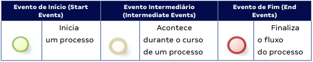

      

> [!TIP] DICAS:
> - O círculo é a representação do evento em BPMN.
> - Evento de início: sempre do tipo catch (aguarda a ocorrência de um evento para realizar o disparo do processo).
> - Evento de fim: sempre do tipo throw (marca que o processo termina com a geração de um fato).

> [!CAUTION] OBSERVAÇÃO:
> - É recomendável que todo processo tenha um evento de início e ao menos um evento de fim para facilitar a leitura do diagrama.
> - Não existem eventos futuros, existem eventos de início, intermediários e de fim.

### 1.2 Eventos mais Complexos

    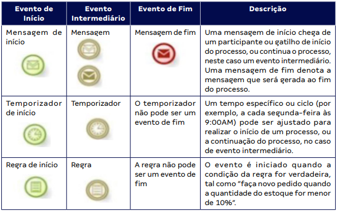

    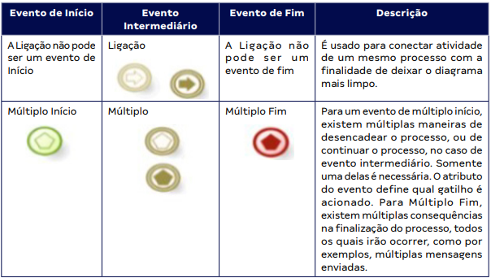

              

    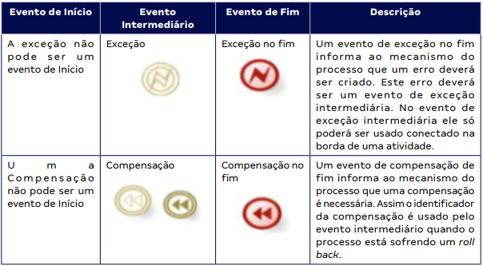

    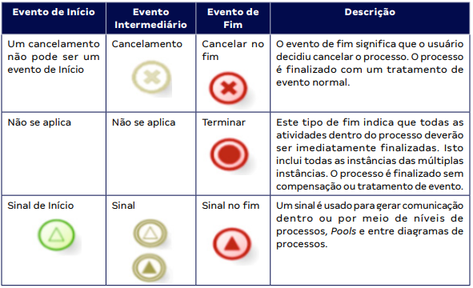

             

## 2. Eventos de Início
- Marca o ponto onde deve-se iniciar a leitura ou a execução de um processo.
- Sempre do tipo catch (aguarda a ocorrência de um evento para disparar o processo).

### 2.1 Início Simples (None)
- Representado por um círculo com borda fina sem nenhum ícone interno.
- Indica duas situações possíveis:
  - O processo foi iniciado e a forma de iniciação não foi definida (omitida);
  - O começo do processo acontece de forma interna, não sendo ativado por algo externo ao processo.

    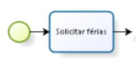

     

> [!CAUTION] OBSERVAÇÃO:
> - Qualquer processo iniciado por requisição externa geralmente utiliza o evento de início de mensagem, não o início simples.

### 2.2 Início por Mensagem (Message)
- Representado por um círculo com borda fina e um envelope no centro.
- Indica que o processo tem início com o recebimento de uma requisição externa (qualquer forma de interação).
- Exemplos: recebimento de formulário preenchido, ligação telefônica, requisição de sistema.

    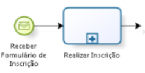

   

### 2.3 Início por Tempo ou Prazo (Timer)
- Representado por um círculo com borda fina e um relógio no centro.
- Indica que o processo será iniciado em um determinado tempo, data ou ciclo.
- Exemplos: "todos os dias às 5:00 da manhã", "a cada 15 dias", "dia 01/01/14".

    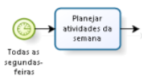

     

> [!TIP] DICAS:
> - Temporizador só existe no início e no intermediário, não há temporizador de fim de processo.

### 2.4 Início Condicional (Conditional)
- Representado por um círculo com borda fina e um ícone específico no centro (semelhante a um envelope ou indicador de condição).
- Indica que o processo terá início quando uma condição for atendida.
- Dados são monitorados até que certa condição seja satisfeita.
- Uma expressão matemática define a condição.
- Exemplo: "quando a impressora estiver com pouco papel, o processo Adicionar papel na impressora será iniciado".

    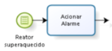

   

### 2.5 Início Múltiplo (Multiple)
- Representado por um círculo com borda fina e um pentágono no centro.
- Indica que o processo pode ser iniciado de várias formas distintas.
- Funciona como um agrupador de eventos de início.
- Para cada evento recebido, o processo é instanciado uma vez.
- É importante indicar na label quais são todos os eventos possíveis.
- Exemplo: processo iniciado pelo recebimento de formulário preenchido ou pelo tempo.

    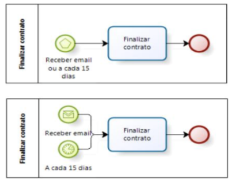

              

### 2.6 Início Múltiplo Paralelo (Parallel Multiple)
- Representado por um círculo com borda fina e um sinal de mais (+) no centro.
- Indica que o processo será iniciado quando todos os eventos forem recebidos simultaneamente.
- Diferença do Múltiplo simples: no paralelo, todos os eventos devem ocorrer para iniciar o processo.
- Exemplo: aguardar a data 01/01/14 E receber o formulário de compras; o processo só inicia quando ambas as condições forem atendidas.

    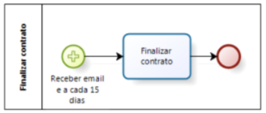

       

### 2.7 Início por Sinal (Signal)
- Representado por um círculo com borda fina e um ícone de sinal (triângulo) no centro.
- Indica que o processo tem início ao receber um sinal lançado por qualquer outro processo.
- O sinal não possui um destinatário específico (pode ser recebido por vários pontos de vários processos ao mesmo tempo).
- Analogia:
  - Evento de mensagem: como uma carta de correio (remetente e um único destinatário);
  - Evento de sinal: como uma antena de rádio (ponto que lança o sinal e todos os receptores captam).

    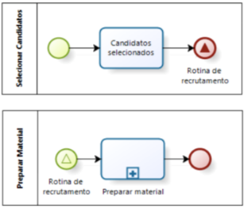

               

> [!TIP] DICAS:
> - Mensagem = comunicação ponto a ponto (um destinatário específico).
> - Sinal = comunicação broadcast (vários destinatários).

## 3. Eventos Intermediários
- Sinalizam um ponto no decorrer do processo no qual é previsto que um fato irá ocorrer.
- Podem ser:
  - Catch: aguardam a ocorrência do fato para que o processo continue;
  - Throw: geram a ocorrência do fato e dão continuidade ao processo.
- Podem ser conectados ao fluxo de sequência ou anexados à borda de uma atividade.

> [!TIP] DICAS:
> - Eventos de borda são desenhados bem na borda da atividade.

### 3.1 Evento Intermediário de Tempo ou Prazo (Timer)
- Representa um fato relacionado a uma condição temporal.
- Pode ser utilizado no fluxo do processo ou na borda de uma atividade.

#### 3.1.1 Timer no Fluxo do Processo
- O processo para naquele ponto e aguarda a condição de tempo se tornar verdadeira.
- Exemplo: após "Preparar viagem", o processo aguarda a data de início da viagem para continuar com "Realizar viagem".

    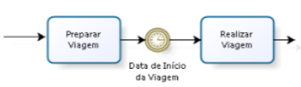

     

#### 3.1.2 Timer na Borda de uma Atividade (Interrupting)
- Borda dupla e lisa.
- Se o evento ocorrer enquanto a atividade estiver em execução, ela é interrompida.
- O fluxo segue pelo conector que se origina no evento.
- Exemplo: se a data de entrega prevista for atingida e o recebimento não foi confirmado, a tarefa é cancelada e o fluxo dispara "Cancelar o pedido".

    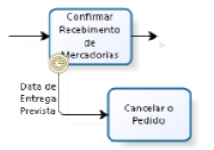

      

#### 3.1.3 Timer na Borda de uma Atividade (Non-interrupting)
- Borda dupla e tracejada.
- Se o evento ocorrer enquanto a atividade estiver em execução, um fluxo paralelo é iniciado.
- A tarefa original permanece aguardando sua execução.
- Exemplo: após dois dias úteis sem finalizar "Avaliar pedido", dispara "Receber aviso de atraso na avaliação", mas a avaliação continua normalmente.

    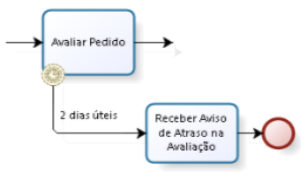

       

> [!CAUTION] OBSERVAÇÃO:
> - Interrupting: interrompe a atividade em execução.
> - Non-interrupting: cria um fluxo paralelo sem interromper a atividade original.

### 3.2 Evento Intermediário Condicional (Conditional)
- Representa um fato relacionado a uma condição de negócio.
- O processo pausa até que a condição se torne verdadeira.
- Também pode ser conectado à borda de atividades (interrupting ou non-interrupting).
- Exemplo: ações são compradas e o processo aguarda até que "Valor de venda atingido" se torne verdadeiro para iniciar "Vender ações".

    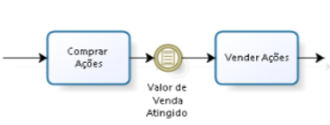

     

### 3.3 Evento de Ligação (Link)
- Evento intermediário.
- Usado para conectar atividades de um mesmo processo.
- Finalidade: deixar o diagrama mais limpo.
- Não pode ser evento de início nem de fim.

### 3.4 Evento Múltiplo Intermediário
- Existem múltiplas maneiras de continuar o processo.
- Somente uma delas é necessária.
- O atributo do evento define qual gatilho é acionado.

### 3.5 Evento de Exceção Intermediária
- Só pode ser usado conectado na borda de uma atividade.
- Não pode ser evento de início.
- Um evento de exceção de fim informa que um erro deve ser gerado; esse erro deve ser capturado por um evento de exceção intermediária.

### 3.6 Evento de Compensação Intermediária
- Não existe evento inicial de compensação.
- Existe evento intermediário e de fim.
- O identificador da compensação é usado quando o processo está sofrendo um rollback (necessidade de desfazer trabalho).

> [!TIP] DICAS:
> - Compensação = desfazer ações já executadas (rollback).
> - Exceção = erro que deve ser tratado.

### 3.7 Evento de Cancelamento Intermediário
- Não existe cancelamento no início.
- Existe cancelamento intermediário e de fim.
- Evento de cancelamento de fim significa que o usuário decidiu cancelar o processo.

### 3.8 Evento de Sinal Intermediário
- Usado para gerar comunicação dentro ou por meio de níveis de processos, entre pools e entre diagramas de processos.

## 4. Eventos de Fim
- Marca o término do processo.
- Sempre do tipo throw (geram um fato ao finalizar).

### 4.1 Fim Simples (None)
- O processo termina sem gerar nenhum fato específico.
- Não possui símbolo interno.

    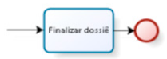

   

### 4.2 Fim por Mensagem (Message)
- O processo é finalizado com o envio de uma comunicação (documento, mensagem, telefonema).
- Usado para iniciar outro processo ou fornecer um resultado.
- Simbolizado por um envelope preto (throw).

    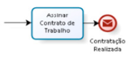

   

### 4.3 Fim Término (Terminate)
- Representado por um círculo preto preenchido.
- O processo é terminado/finalizado por completo, mesmo que existam atividades em fluxos paralelos em execução.
- Se atividades estiverem em execução quando um fluxo atinge o evento terminate, as tarefas pendentes são canceladas.
- O processo é dado como completamente finalizado, sem compensação ou tratamento de evento.
- Exemplo: se "Arquivar processo" termina antes das atividades do fluxo paralelo, o processo chega ao terminate e interrompe as tarefas pendentes.

    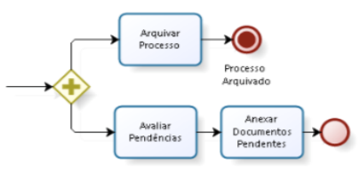

        

> [!CAUTION] OBSERVAÇÃO:
> - O evento terminate interrompe todas as atividades em execução, incluindo múltiplas instâncias.
> - Diferente do evento none, o terminate não aguarda a conclusão dos fluxos paralelos.

### 4.4 Fim Múltiplo (Multiple)
- Existem múltiplas consequências na finalização do processo.
- Todos os eventos de fim irão ocorrer.
- Exemplo: múltiplas mensagens enviadas utilizando esse elemento de notação.

### 4.5 Fim por Exceção
- Informa ao mecanismo do processo que um erro deverá ser criado.
- Esse erro deve ser capturado por um evento de exceção intermediária.

### 4.6 Fim por Compensação
- Informa ao mecanismo do processo que uma compensação é necessária.
- O identificador da compensação é usado pelo evento intermediário quando o processo está sofrendo rollback.

### 4.7 Fim por Cancelamento
- Significa que o usuário decidiu cancelar o processo.
- O processo é finalizado com um tratamento de evento normal.

### 4.8 Fim por Sinal
- Gera um sinal que pode ser recebido por vários processos.
- Comunicação do tipo broadcast.

> [!TIP] DICAS:
> - Regra e temporizador não podem ser eventos de fim.
> - Exceção e compensação não podem ser eventos de início.
> - Cancelamento não pode ser evento de início.
> - Ligação não pode ser início nem fim.

> [!CAUTION] OBSERVAÇÃO:
> - O conector de fluxo de mensagem é representado por uma linha tracejada com seta vazada apontando para o destino.
> - Fluxo de mensagem conecta elementos de envio e recebimento de mensagem.