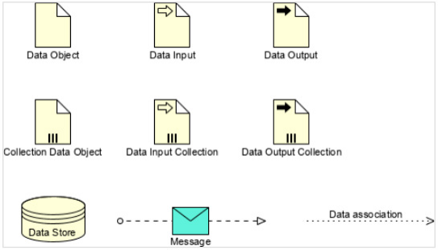
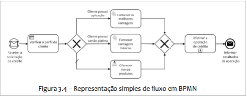
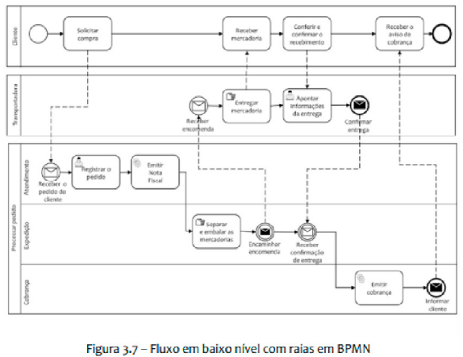

# Elementos BPMN 4

## 1. Artefatos em BPMN
- Artefatos são elementos complementares que auxiliam na sinalização visual do processo.
- Não influenciam diretamente no fluxo de trabalho.
- Fornecem informações adicionais sobre o processo.
- Artefatos são informações adicionais, não alteram o fluxo.

### 1.1 Objeto de Dados (Data Object)
- Representa um conjunto de informações no contexto do processo.
- Representado por um ícone de página com a ponta dobrada.
- Exemplo: uma "lista de alunos" é um objeto de dados que transita na tarefa de verificar inscrições pagas e é consumido pela atividade de providenciar a impressão dos certificados.
- Especializações do objeto de dados:
  - Objeto de dados simples;
  - Seta de entrada ou saída de dados;
  - Coleção de dados: representada por três pontinhos na notação;
  - Repositório de dados: representado por um símbolo específico que indica a armazenagem de informações dentro do processo.

> [!CAUTION] OBSERVAÇÃO:
> - Dados inseridos em um repositório de dados permanecem armazenados após a conclusão do processo; não "perecem" ao final da execução.

### 1.2 Anotação de Texto (Text Annotation)
- Utilizada para agregar comentários ao processo ou a um elemento específico.
- Representada por uma área de texto marcada com bordas laterais.
- Pode ou não estar conectada a elementos do diagrama.
- Exemplo: anotação na tarefa de preparar cadeiras e mesas indicando que a disposição deve seguir um padrão estabelecido.

### 1.3 Grupo (Group)
- Elemento de anotação visual utilizado para destacar grupos de atividades.
- Representado por um retângulo com bordas arredondadas e linha tracejada.
- Não influencia o fluxo do processo.
- Exemplo: um grupo denominado "Controle das inscrições" destacando elementos relacionados a esse controle.

### 1.4 Conector de Associação (Association)
- Conector específico para ligar elementos de artefatos no diagrama.
- Representado por uma linha pontilhada.
- Classificado como artefato em algumas classificações.

    

            

## 2. Fluxo de Mensagem
- Representado por uma seta tracejada.
- Indica a comunicação entre dois pools (processos distintos).
- Conecta elementos de envio e recebimento de mensagem.

> [!TIP] DICAS:
> - Fluxo de mensagem = seta tracejada = comunicação entre processos/pools.

## 3. Fluxo de Sequência
- Representado por uma seta sólida (linha cheia).
- Indica o controle do fluxo e a sequência das atividades dentro de um mesmo processo.

## 4. Elementos de Conexão
- Setas sólidas: fluxo de controle (sequência) dentro do mesmo processo.
- Setas tracejadas: fluxo de mensagem (comunicação entre processos distintos) ou associação (conexão com artefatos).

> [!CAUTION] OBSERVAÇÃO:
> - Setas tracejadas não servem para conectar figuras básicas em um mesmo processo. Isso é função do fluxo de sequência (seta sólida).

### Exemplos de Modelagem BPMN

    

           

    

     